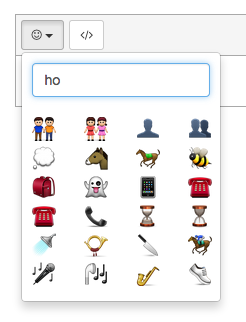

# Summernote emoji plugin



##Usage

 - Include `summernote-ext-emoji.js`
 - Add `emoji` to summernote toolbar

##Example

```html
<textarea id="summernote"></textarea>
```

```javascript

document.emojiSource = '../pngs/'; //relative path to emojis

$('#summernote').summernote({
  toolbar: [
		['misc', ['emoji']],
		['code', ['codeview']]
	]
});
```
